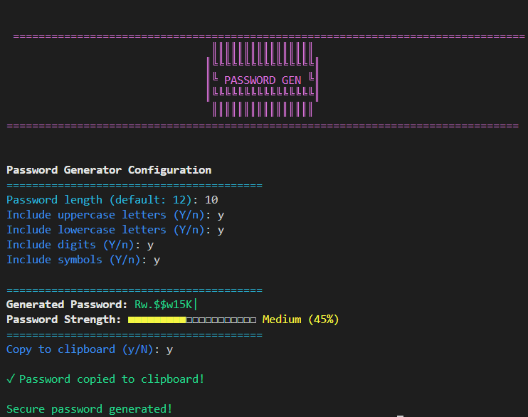
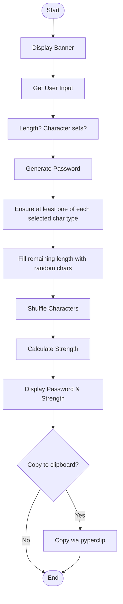

# Password Generator

A secure and customisable password generator with strength evaluation, built in Python with a colorful command-line interface.

 

## Features

- 🔐 Generate strong, random passwords with customizable length (8+ characters)
- 🎨 Colorful command-line interface with ANSI colors
- ⚙️ Customize character sets:
  - Uppercase letters (A-Z)
  - Lowercase letters (a-z)
  - Digits (0-9)
  - Symbols (!@#$%^&* etc.)
- 📊 Password strength evaluation with visual meter
- 📋 Optional clipboard copying (requires `pyperclip`)
- ❓ Interactive prompts with sensible defaults

## Installation

1. Ensure you have Python 3.6+ installed
2. Clone this repository or download the `main.py` file
3. (Optional) Install the clipboard dependency:
   ```bash
   pip install pyperclip
   ```

## Usage
Run the program
```bash
python main.py
```
Follow the interactive prompts to configure your password:
1. Enter desired password length (minimum 8)
2. Select which character types to include
3. View your generated password and strength rating
4. Choose whether to copy to clipboard


### Password Strenght Algorithm

The strength meter evaluates:
- Password length (longer = stronger)
- Character diversity (using multiple character types = stronger)
- Visual feedback with color-coded strength levels:
    - 🔴 Red: Weak (<40%)
    - 🟡 Yellow: Medium (40-70%)
    - 🟢 Green: Strong (70-100%)


## Password Generator

A secure and customisable password generator with strength evaluation, built in Python with a colorful command-line interface.

### Flowchart


